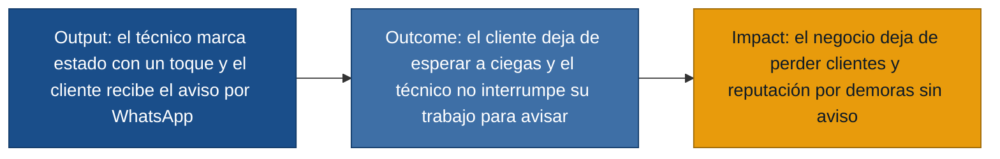

# Hipótesis y experimentos — tickeSoporte

> Discovery: `discoveries/tickeSoporte`
> Artefacto legible derivado de `experiment-board.json`.
> Regla: cada hipótesis ata un **supuesto riesgoso del MVP** y propone el **experimento más barato** que lo aclara antes de construir.

## Puente output → outcome → impact (origen de los supuestos)

Las cinco hipótesis atacan los **saltos de fe** que conectan esa cadena: que el canal funcione, que el técnico use el botón, que la latencia se cumpla en campo, que el panel sea operable por terceros y — la más estructural — que el aviso cambie realmente el comportamiento del cliente.

## Tablero de experimentos (de mayor a menor riesgo)

| # | Hipótesis | Riesgo | Experimento | Caja | Umbral |
|---|---|---|---|---|---|
| [H-01](#h-01-el-cliente-efectivamente-lee-el-whatsapp-del-negocio--riesgo-alto) | El cliente lee el WhatsApp del negocio a tiempo | alto | Smoke test manual (gerente envía) | 2 semanas | ≥ 70 % abierto en ≤ 30 min, n ≥ 20 |
| [H-02](#h-02-el-técnico-mantiene-el-hábito-de-marcar-estado--riesgo-alto) | El técnico pulsa el botón con consistencia | alto | Mago de Oz con recordatorio suave | 5 días | ≥ 80 % de trabajos marcados, n ≥ 15 |
| [H-05](#h-05-el-aviso-cambia-el-comportamiento-del-cliente--riesgo-alto) | El aviso reduce llamadas y salidas del cliente | alto | A/B cuasi-experimental con aviso manual | 2 semanas | ≥ 50 % de reducción de llamadas, n = 20 |
| [H-03](#h-03-la-notificación-llega-en-minutos-aunque-la-red-sea-mala--riesgo-medio) | La notificación llega ≤ 5 min con red débil | medio | Prototipo evolutivo mínimo (formulario web + cola) | 1 semana | ≥ 90 % entregado en ≤ 5 min, n ≥ 20 |
| [H-04](#h-04-el-panel-es-operable-por-terceros-sin-capacitación--riesgo-medio) | Una persona nueva usa el panel en ≤ 2 min | medio | Mago de Oz con persona ajena al negocio | 3 días | ≥ 4/5 consultas correctas en ≤ 2 min |

```mermaid
flowchart TD
  classDef test fill:#E2EAF3,stroke:#1A4E8A,color:#0E1A26;
  classDef ok fill:#E3F1E8,stroke:#2E7D52,color:#0E1A26;
  classDef no fill:#F6E2DD,stroke:#B3402F,color:#0E1A26;
  classDef high fill:#F6E2DD,stroke:#B3402F,color:#0E1A26;
  classDef mid fill:#F6E3BC,stroke:#9A6605,color:#0E1A26;
  H1[H-01: el cliente abre el WhatsApp]:::high
  H2[H-02: el técnico pulsa el botón]:::high
  H5[H-05: el aviso cambia comportamiento]:::high
  H3[H-03: la notificación llega en minutos]:::mid
  H4[H-04: el panel es operable por terceros]:::mid
  H1 -->|pasa| K1[Construir automatización del envío]:::ok
  H1 -->|falla| V1[Pivotar canal: SMS o enlace]:::no
  H2 -->|pasa| K2[Construir botón de un toque]:::ok
  H2 -->|falla| V2[Agregar disparador automático al cerrar trabajo]:::no
  H5 -->|pasa| K3[Construir MVP completo]:::ok
  H5 -->|falla| V3[Revisar contenido del mensaje]:::no
  H3 -->|pasa| K4[Implementar envío + cola]:::ok
  H3 -->|falla| V4[Forzar marca en zona con señal]:::no
  H4 -->|pasa| K5[Invertir en panel compartido]:::ok
  H4 -->|falla| V5[Reducir panel o replantear la historia]:::no
```

---

## Test cards

### [H-01] El cliente efectivamente lee el WhatsApp del negocio — riesgo: alto

- **Supuesto a probar:** Los clientes abren y leen los mensajes de WhatsApp del negocio a tiempo (antes de la llegada del técnico); si no leen, la notificación automática no comunica nada y todo el MVP se queda en output sin outcome.
- **Hipótesis:** Creemos que los clientes residenciales abrirán y leerán el mensaje automático de WhatsApp del negocio en los 30 minutos previos a la llegada del técnico, porque ya reciben la dirección del trabajo por ese mismo canal y porque dijeron en entrevista que ese aviso les resolvería el problema.
- **Señal medible:** Tasa de apertura del mensaje (confirmación de lectura / visto bueno) respecto del total de mensajes enviados, medida por el proveedor de WhatsApp/SMS durante 2 semanas. No es vanidad: si el cliente no abre, el output no genera outcome.
- **Criterio de éxito:** ≥ 70 % de los mensajes enviados quedan leídos (visto bueno o acuse equivalente) en los 30 minutos posteriores al envío, en una muestra de al menos 20 trabajos.
- **Experimento:** Smoke test: durante 2 semanas, en lugar de la notificación automática desde la herramienta, el gerente envía manualmente por WhatsApp Business el mismo texto que enviaría el sistema (nombre del técnico, hora estimada, nombre del negocio) en el momento del cambio de estado. Mide cuántas conversaciones quedan con visto bueno en ≤ 30 min. Si no se llega al umbral, no se ha construido nada que valga la pena.
- **Caja de tiempo/costo:** 2 semanas · costo aproximado: 0 (solo tiempo del gerente para enviar el mensaje manualmente en lugar de pulsar un botón que aún no existe).
- **Regla de decisión:** Si pasa (≥ 70 % abierto en ≤ 30 min) → perseverar: construir la automatización del envío, sabiendo que el canal funciona. Si falla (< 70 % abierto) → pivotar el canal: probar SMS con enlace a vista de estado (US-04) o cambiar el horario de envío; el problema no es la herramienta, es el canal elegido.

### [H-02] El técnico mantiene el hábito de marcar estado — riesgo: alto

- **Supuesto a probar:** El técnico realmente pulsa el botón "voy en camino" y "se demoró" de forma consistente mientras trabaja con las manos ocupadas; si se olvida, no hay cambio de estado y por tanto no hay aviso al cliente.
- **Hipótesis:** Creemos que el técnico pulsará el botón de estado con la frecuencia necesaria (al menos una vez por trabajo relevante) sin que se lo recuerden, porque el dolor de la llamada es suyo también y un toque es menos costoso que descolgar y redactar.
- **Señal medible:** Tasa de trabajos del día en los que el técnico marca al menos un cambio de estado relevante (voy en camino / demorado) durante la semana de medición. Mide comportamiento real, no intención declarada.
- **Criterio de éxito:** ≥ 80 % de los trabajos del día registran al menos un cambio de estado marcado por el técnico, en una muestra de al menos 15 trabajos seguidos durante 5 días.
- **Experimento:** Mago de Oz: durante 5 días, el gerente lleva un papel con dos columnas ("voy en camino" / "se demoró"). Cada vez que el técnico termina un trabajo, el gerente le manda un WhatsApp del tipo "¿ya vas al siguiente?" y registra si el técnico responde con el estado. Si el técnico mantiene el hábito con un recordatorio tan suave, lo hará con un botón. Mide frecuencia real, no intención.
- **Caja de tiempo/costo:** 5 días hábiles · costo: ~30 minutos/día del gerente (un recordatorio + un registro en papel). Sin código.
- **Regla de decisión:** Si pasa (≥ 80 % de los trabajos marcados) → perseverar: construir el botón de un toque (US-01, US-02), el hábito se sostiene. Si falla (< 80 %) → pivotar el diseño: agregar un disparador automático (al cerrar el trabajo anterior, el sistema pregunta y propone el siguiente estado con un toque de confirmación) o investigar por qué se olvida (carga cognitiva, momento del día) antes de seguir construyendo.

### [H-05] El aviso cambia el comportamiento del cliente — riesgo: alto

- **Supuesto a probar:** El aviso automático cambia el comportamiento del cliente (deja de llamar, deja de irse) y por tanto protege al negocio de la pérdida de clientes y reputación declarada por el gerente. Sin cambio de comportamiento, la métrica "avisos enviados" no se traduce en impact.
- **Hipótesis:** Creemos que los clientes que reciban el aviso automático antes de la llegada del técnico llamarán menos para preguntar por el estado y no se irán del lugar de espera, porque dijeron en entrevista que el aviso por sí solo les permite planificar y dejar de interrumpir.
- **Señal medible:** Tasa de clientes que llaman para preguntar por el estado en el día del trabajo, comparando grupo que recibió aviso automático vs. grupo que no lo recibió. Esta es la métrica que conecta output con outcome.
- **Criterio de éxito:** Reducción de al menos 50 % en la tasa de llamadas de clientes preguntando por el estado (de una línea base a medir en los primeros 10 trabajos sin aviso) en los siguientes 10 trabajos con aviso automático enviado a tiempo.
- **Experimento:** A/B cuasi-experimental: durante 2 semanas, en días alternos, el gerente envía (o no envía) el aviso manualmente como en H-01, pero esta vez registra además cuántas llamadas recibe preguntando por el estado ese día. La métrica es la diferencia de llamadas entre días con aviso y días sin aviso, no la cantidad de avisos enviados.
- **Caja de tiempo/costo:** 2 semanas · costo: el mismo que H-01 (envío manual) + 5 minutos/día para registrar las llamadas entrantes que preguntan por estado.
- **Regla de decisión:** Si pasa (≥ 50 % de reducción de llamadas) → perseverar: la cadena output→outcome está validada, construir el MVP. Si falla (< 50 % de reducción) → reevaluar: el aviso puede llegar pero no cambiar comportamiento; en ese caso, explorar si el contenido del mensaje es insuficiente (falta la hora estimada concreta, falta el nombre del técnico) antes de seguir construyendo sobre esta hipótesis.

### [H-03] La notificación llega en minutos aunque la red sea mala — riesgo: medio

- **Supuesto a probar:** La notificación llega al cliente en pocos minutos aunque la cobertura de red sea mala en la zona del trabajo del técnico; si se demora, llega cuando el cliente ya se fue y pierde utilidad.
- **Hipótesis:** Creemos que el técnico podrá registrar el cambio de estado y el cliente lo recibirá en menos de 5 minutos aunque la red 4G/3G sea débil en el lugar del trabajo, porque la acción se encola localmente y el envío se hace cuando hay señal.
- **Señal medible:** Latencia extremo a extremo: tiempo entre el momento en que el técnico marca el estado y el momento en que el mensaje aparece como entregado al cliente, en condiciones reales de campo (no en oficina).
- **Criterio de éxito:** ≥ 90 % de los cambios de estado se reflejan como mensaje entregado al cliente en ≤ 5 minutos, durante al menos 20 eventos medidos en condiciones reales (incluyendo trabajos en zonas con señal débil reportadas por el técnico).
- **Experimento:** Prototipo evolutivo mínimo: durante 1 semana, una hoja de cálculo en la nube + un formulario web muy simple que el técnico abre desde el navegador del teléfono en el momento del cambio. Si no hay señal, lo deja escrito y la herramienta lo envía cuando detecta conexión. Mide la latencia real entre marca y entrega del mensaje al cliente.
- **Caja de tiempo/costo:** 1 semana · costo: 1 día del gerente para armar la hoja + 1 día para un formulario simple; el resto es uso real.
- **Regla de decisión:** Si pasa (≥ 90 % en ≤ 5 min) → perseverar: implementar el envío automático y el manejo de cola. Si falla (< 90 %) → pivotar el mecanismo: evaluar un dispositivo intermedio (por ejemplo, un SIM de datos secundario) o forzar al técnico a marcar el estado al volver al vehículo/lugar con señal, antes de seguir.

### [H-04] El panel es operable por terceros sin capacitación — riesgo: medio

- **Supuesto a probar:** El panel de estado diario es operable por quien ayude al gerente a contestar mensajes sin capacitación especial; sin esto, el gerente sigue siendo el cuello de botella y se duplica el problema (doble-rol-atención).
- **Hipótesis:** Creemos que una persona sin contexto previo (familiar, asistente, secretaria) podrá consultar y actualizar el estado de los trabajos del día en menos de 2 minutos por consulta, tras una explicación de 10 minutos, porque el panel muestra solo lo relevante (trabajo, dirección, estado actual).
- **Señal medible:** Tiempo promedio por consulta correcta al panel (encontrar el estado actualizado de un trabajo) medido con cronómetro por el gerente observador.
- **Criterio de éxito:** ≥ 4 de 5 consultas se resuelven correctamente en ≤ 2 minutos, tras una sola explicación de 10 minutos, con una persona sin experiencia previa en el negocio.
- **Experimento:** Mago de Oz con persona nueva: una vez al día durante 3 días, el gerente le muestra el panel (puede ser una hoja de cálculo compartida) a alguien que normalmente no contesta mensajes del negocio. Le explica 10 minutos cómo leer el estado de cada trabajo y luego le hace 5 preguntas reales del tipo "¿en qué estado está el trabajo de la calle X?". Mide tiempo y acierto.
- **Caja de tiempo/costo:** 3 días · costo: ~15 minutos del gerente por sesión + la cooperación de la persona que ayuda.
- **Regla de decisión:** Si pasa (≥ 4/5 en ≤ 2 min) → perseverar: invertir en hacer el panel pulido y compartido (US-06). Si falla (< 4/5) → pivotar: o el panel muestra demasiada información (reducir a lo mínimo) o requiere que la persona tenga contexto del cliente; en ese caso, replantear si esta historia entra al MVP o se atiende con un canal más simple (mensaje directo al gerente).

---

## Conexión con la evidencia

- **H-01, H-05** se anclan en `cliente.md` (ventana-tiempo-amplia, espera-sin-informacion, no-poder-planificar, cambio-proveedor-comunicacion).
- **H-02** se ancla en `tecnico.md` (no-poder-atender-telefono, cliente-sin-actualizacion).
- **H-03** se ancla en `tecnico.md` y `cliente.md` (latencia esperada y dolor por silencio prolongado).
- **H-04** se ancla en `gerente_general.md` (doble-rol-atencion, agenda en papel que tampoco resuelve la coordinación con quien ayuda).

Cada hipótesis nace de un dolor declarado en entrevistas; ninguna introduce un supuesto nuevo que no esté respaldado por la evidencia del discovery.

## Orden de ejecución recomendado

Los tres de riesgo alto son interdependientes (sin canal que se lee, sin hábito del técnico, sin cambio de comportamiento, no hay MVP viable). El orden más barato de información es:

1. **H-01** (smoke test manual, 2 semanas, costo ≈ 0) — responde el riesgo más estructural: ¿el canal elegido sirve? Si falla, el MVP entero se replantea antes de gastar en código.
2. **H-05** se puede correr en paralelo con H-01 sobre el mismo envío manual: el gerente ya está mandando mensajes, solo añade el registro de llamadas. Si ambos pasan, la cadena output→outcome está validada.
3. **H-02** (5 días, costo ≈ 0) — una vez validado el canal, valida el hábito del técnico.
4. **H-03** y **H-04** (1 semana y 3 días, costo bajo) — riesgos operativos; se atacan después de validar los estructurales porque solo tienen sentido si H-01, H-02 y H-05 pasan.

Inversión total para validar todos los supuestos antes de construir: ≈ 4 semanas de bajo costo, sin código de producto.