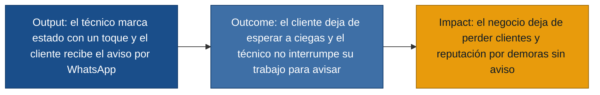

# MVP Canvas — tickeSoporte

> Discovery: `discoveries/tickeSoporte`
> Evidencia: `discoveries/tickeSoporte/interviews/`
> Regla: cero invención. Cada bloque del canvas se ancla a entrevistas y a requisitos de `requisitos.md`.

## Puente output → outcome → impact

## MVP Canvas

| Bloque | Contenido |
|---|---|
| Propuesta de valor | Cuando el técnico marca el estado del trabajo con un toque, el cliente recibe un aviso automático por WhatsApp con la hora estimada, sin que el técnico tenga que llamar ni redactar nada. |
| Segmento de usuarios | Técnicos de campo que coordinan visitas por WhatsApp y llamadas; clientes residenciales que contratan el servicio; gerente general del negocio (dueño), que cumple doble rol. |
| Funcionalidades mínimas | (1) Agenda del día con orden de trabajos, dirección y hora estimada — **US-05**. (2) Botón de un toque "voy en camino" y "se demoró, nueva hora" para el técnico — **US-01, US-02**. (3) Notificación automática al cliente por WhatsApp en cada cambio de estado, con hora estimada — **US-04** (canal) + **US-01/US-02** (eventos). (4) Vista de estado del trabajo para el cliente, vía enlace, sin app nueva obligatoria — **US-03**. (5) Panel de estado compartido para que quien ayude a contestar mensajes vea la agenda y el estado de cada trabajo — **US-06**. |
| Resultado esperado (outcome) | El cliente deja de esperar a ciegas y puede planificar su día; el técnico no interrumpe su trabajo para avisar; el gerente no duplica el rol de "técnico" y "call center". |
| Métrica de éxito | **Tasa de trabajos del día en los que el cliente recibió al menos un aviso automático de estado antes de la llegada del técnico**, medida durante 4 semanas consecutivas. Umbral: ≥ 70 % de los trabajos. Si el número sube, el gerente sabe que la comunicación deja de depender de acordarse de llamar. |
| Riesgos / supuestos | (a) Los clientes abren y leen los mensajes de WhatsApp del negocio (Riesgo: alto — si no leen, el aviso no sirve). (b) El técnico realmente pulsa el botón "voy en camino" y "se demoró" de forma consistente (Riesgo: alto — si se olvida, no hay cambio). (c) La notificación llega en pocos minutos aunque la red sea mala en la zona del trabajo (Riesgo: medio). (d) El negocio no depende de un único técnico que olvide actualizar; la herramienta debe ser operable también por quien ayude al gerente (Riesgo: medio). |
| Fuera de alcance (por ahora) | App móvil nativa para el cliente (se usa WhatsApp/enlace web). Integración con calendario del teléfono del gerente (la agenda se carga en la herramienta). Facturación, pagos, historial del cliente. Reseñas o encuestas post-servicio. Optimización de rutas (qué orden de visitas minimiza tiempo). Multi-técnico simultáneo. Notificaciones push dentro de una app propia. |

## Cómo se conecta con la evidencia

- **Propuesta de valor** se ancla en el dolor compartido por las 3 personas: el cliente no sabe nada mientras el técnico está en el trabajo anterior (`cliente.md`, `tecnico.md`, `gerente_general.md`).
- **Funcionalidades mínimas** salen de `user-stories.md` (US-01…US-06), que a su vez se anclan en R-01…R-07 (`requisitos.md`).
- **Métrica de éxito** pasa la prueba ácida: si la tasa sube, el gerente puede decir qué decisión cambia ("si la comunicación automática funciona, dejo de depender de acordarme de llamar para mantener al cliente informado"). No es de vanidad: mide un comportamiento real del lado del cliente (recibió el aviso antes de la llegada).
- **Riesgos / supuestos** se prueban con hipótesis falsables en una fase posterior (`/discovery:experiments`); aquí se listan explícitamente para que la métrica de éxito no se confunda con "se lanzó la funcionalidad".
- **Fuera de alcance** se justifica por costo vs. valor para el MVP: app nativa, integración calendario, reseñas, optimización de rutas, etc. no atacan el núcleo de dolor declarado en las entrevistas.

## Cobertura historia → dolor

- **US-01** atacar el dolor compartido del técnico (`no-poder-atender-telefono`, `tecnico.md`) y del cliente (`espera-sin-informacion`, `cliente.md`).
- **US-02** cubre `incertidumbre-duracion` del técnico y `ventana-tiempo-amplia` del cliente.
- **US-03** cubre `no-poder-planificar` del cliente.
- **US-04** cubre el requisito no funcional R-09 (canal que el cliente ya usa).
- **US-05** prerequisite operativo para que el técnico tenga qué marcar; cubre el dolor del gerente "se complica con la agenda en papel" (`gerente_general.md`).
- **US-06** cubre `imposible-coordenar-desde-campo` y `doble-rol-atencion` del gerente.

US-01…US-04 son el **camino crítico** para entregar la propuesta de valor; US-05 y US-06 son habilitadoras (sin agenda no hay qué marcar y sin lista el gerente no se entera). Por eso las 6 entran al MVP y no se quedaron fuera.
