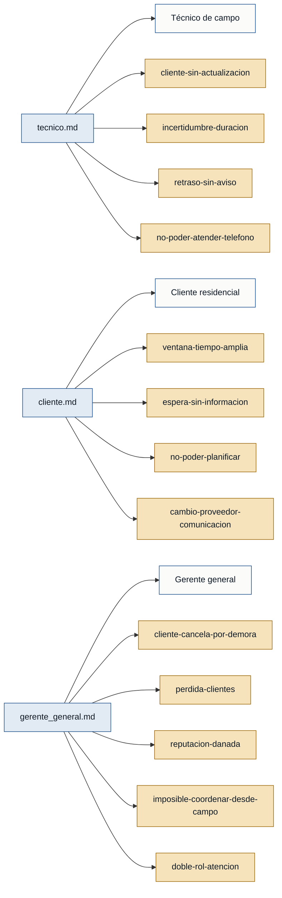

# Personas y Stakeholders — tickeSoporte

> Discovery: `discoveries/tickeSoporte`
> Evidencia: `discoveries/tickeSoporte/interviews/`
> Regla: cero invención. Cada persona cita el archivo de entrevista que la respalda.

## Mapa de trazabilidad

## Personas

### T. (técnico) — Técnico de campo
- **Contexto:** Técnico que instala y mantiene equipos de climatización; trabaja solo la mayor parte del día y recibe los trabajos por WhatsApp la noche anterior o la misma mañana.
- **Objetivo principal:** Cumplir la ruta del día sin perder tiempo en llamadas y sin generar fricción con el cliente que viene después.
- **Dolores:**
  - El cliente del siguiente trabajo no sabe nada mientras él está en el anterior (tecnico.md).
  - No puede estimar de antemano cuánto le tomará cada trabajo, porque depende del estado del equipo (tecnico.md).
  - Ha llegado tarde a un trabajo y el cliente dejó una reseña negativa aunque el servicio quedó bien (tecnico.md).
  - No puede estar pendiente del teléfono mientras trabaja, por eso no llama para avisar (tecnico.md).
- **Respaldo:** primera mano (`tecnico.md`, `rol_entrevistado: técnico`).

### C. (cliente) — Cliente residencial
- **Contexto:** Persona que contrata servicios técnicos de aire acondicionado para su vivienda; suele recibir un rango horario amplio ("en la tarde") y no tiene información hasta que el técnico llega.
- **Objetivo principal:** Recibir al técnico en una ventana de tiempo realista, poder organizar su día y tener certeza de que el servicio está en curso.
- **Dolores:**
  - Recibe un rango horario amplio ("la tarde" puede ser las dos o las seis) y no sabe a qué hora esperar (cliente.md).
  - Espera sin información y llama para preguntar, pero el técnico contesta como si lo interrumpiera (cliente.md).
  - No puede planificar nada: no sale, no se compromete, por si el técnico llega en cualquier momento (cliente.md).
  - Ya ha cambiado de proveedor por este motivo, y pagaría un poco más por mejor comunicación (cliente.md).
- **Respaldo:** primera mano (`cliente.md`, `rol_entrevistado: cliente`).

### G. (gerente general) — Gerente general (dueño)
- **Contexto:** Dueño de un negocio de servicio técnico de aire acondicionado; cumple doble rol: administra y ejecuta trabajos en campo. Recibe llamadas mientras está trabajando.
- **Objetivo principal:** Que el negocio no pierda clientes ni reputación por la falta de comunicación de los tiempos, sin tener que duplicar el rol de "técnico" y "call center".
- **Dolores:**
  - Ha perdido clientes que esperaban y se fueron, o que cancelaron el trabajo por la demora (gerente_general.md).
  - Una demora de dos horas derivó en cancelación y en que el cliente hablara mal del negocio (gerente_general.md).
  - Está metido en un trabajo y no puede contestar el teléfono ni acordarse de avisar al siguiente cliente (gerente_general.md).
  - La agenda en papel y el calendario del teléfono no resuelven la comunicación con el cliente; quien ayuda a contestar mensajes no sabe en qué estado está cada trabajo (gerente_general.md).
- **Respaldo:** primera mano (`gerente_general.md`, `rol_entrevistado: gerente general`).

## Stakeholders

No se identificaron stakeholders con interés en el sistema que no sean a la vez usuarios directos. El gerente general aparece como persona primaria porque usa el sistema a diario; su interés comercial (pérdida de clientes, reputación) está reflejado en sus dolores arriba, no se duplica en una entrada de stakeholder.
